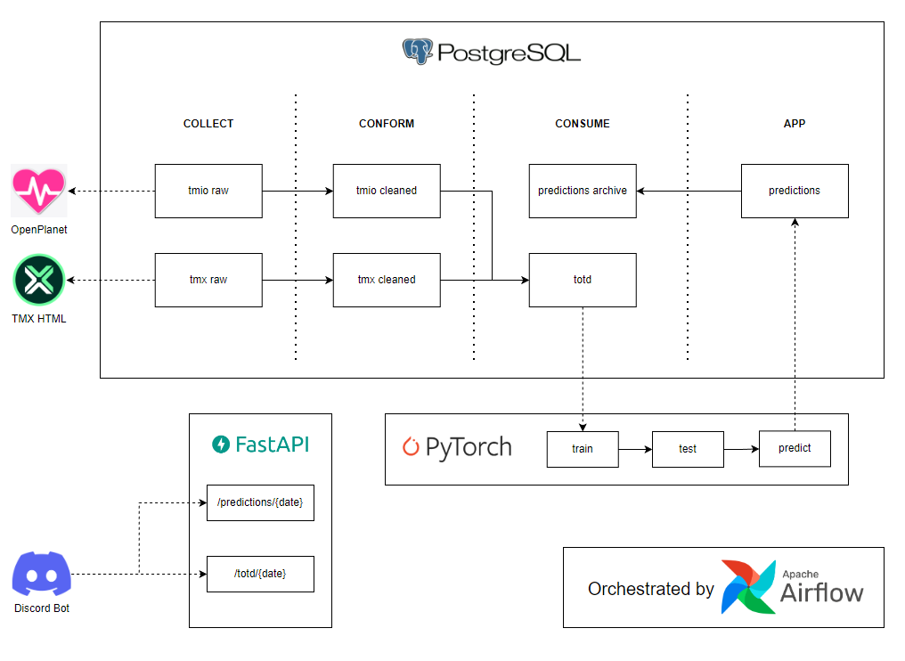

# TOTD-AI

Overengineering an entire data lake environment to support an AI application that predicts future Track Of The Day selections in Trackmania 2020, then making those predictions accessible via API routes that integrate with web browsers, Discord bots, and more.



## Quickstart

Just run `docker-compose up --build`. Will require a beefy computer to run locally, 10GB+ of RAM.

Airflow:
```
UI: localhost:8080
Username: airflow
Password: airflow
```

Postgres:
```
UI: localhost:8081
System: PostgreSQL
Server: trackmania-postgres
Username: airflow
Password: airflow
Database: trackmania
```
